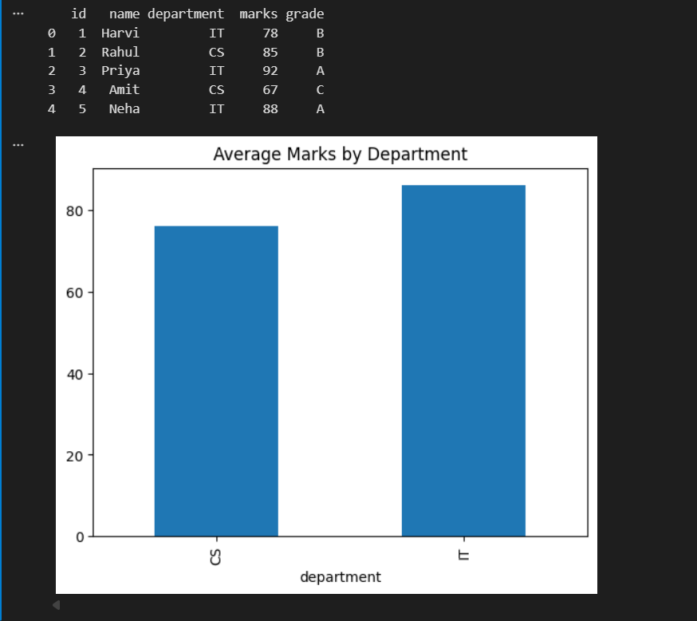

Data Engineering Pipeline (ETL)

Overview
End-to-end ETL pipeline using Python. Extracts data from CSV and APIs, transforms using Pandas, and loads into SQLite and MongoDB.

Features
- CSV + API ingestion
- Data cleaning & transformation (grading)
- SQLite storage + SQL analysis
- MongoDB loading
- Real-time streaming simulation
- Basic visualization

How to Run
pip install -r requirements.txt
python scripts/load_sqlite.py

Output

